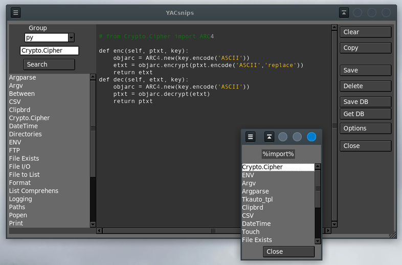

# Yacsniper
## Yet Another Code Snip Organizer
### Desktop Database to store, organize, and access code snippets

_**For Linux**_

Uses python 3 and Tkinter with ttkthemes

_Yacsniper_ is a versatile database manager designed for organizing code snippets, 
structured around topics and items. For example, a topic could be "Python," while an item might be "Formatting."

The database includes various pre-defined topics and items, 
but its primary aim is to allow you to customize it by adding your own snippets (topics and items).

When you're familiar with the topic, you can **search** all items that include the information you're after.

The `csnips.ini` file allows for some customization:  
<code>
\# font=DejaVu Sans Mono  
\# font=Liberation Mono  
\# font=Nimbus Mono  
font=Andale Mono  
\# font=Ubuntu Mono  
\# font=Tlwg Mono  
fontsize=10  
fg=snow2  
bg=#333  
cursorcolor=#fff  
literals=light goldenrod  
numbers=LightBlue1  
remarks=lightgreen  
tabsize=2  
autocopy=off  
browser=firefox  
upload=uploadscript.sh  
download=downloadscript.sh  
</code>

### Starting CSnips:

>`$ python3 /path.../csnips.py`

Note: put all csnips code in one directory.

The CSnips GUI interface will 'remember' 
its width/height and screen position from
each use. 

**Organization** in the csnips.db database
is by "Group" and snippet name. for instance, "python" and "FTP".
To start a new "Group" type in the name
of the group in the "Group" ComboBox.

**To add a snippet** type in the name
into the Entry box below the "Group" 
ComboBox. Enter your snippet text into
the text area and click "Save."

To **access a snippet** first select the "Group"
from the "Group" ComboBox. Then Click
the snippet name in the list. 

To **delete a snippet** use the "Delete"
button.

To **delete an entire "Group"** first click
the "Group" name in the ComboBox. Then
type the "Group" name into the snippet
Entry box as well. Then click "Delete."

To **view and change options** click the
"Options" button. To save "Options"
click the "Save" button. **Do not ADD or DELETE the options**.

To **search for text** in a selected group, start by choosing the group. Next, type your search text into the entry box and click on 'Search.' A new window will open, 
displaying a list of items that match the search text. Click on any item to view it in the code text area.
To quit the app click "Close."

To **copy text** from the snip window click the copy button. To **copy a portion of the text**
first select the text then click the copy button.

**Right-Clicking selected text** will have the following actions:

- Text begins with "http..."
    - A browser opens to the selected URL
- Text begins with ">name-of-a-bash-file"
    - The bash file (shell script) is executed
- Text is some selected plain Text
    - A browser opens to a search of the text 

Other hotkeys:  
__Ctrl-a__				Select All  
__Ctrl-s__				Save  
__Ctrl-q__				quit the application  

**Selecting the text of a hyperlink or file**, and 
then Right-Clicking it, will open it
in the specified web browser.

The **"Save DB"** and **"Get DB"** buttons execute scripts that you define
and code (presumably) to upload and download the _csnips.db_ file.
**"Save DB"** and **"Get DB"** buttons are not available in the Windows version.

:)
